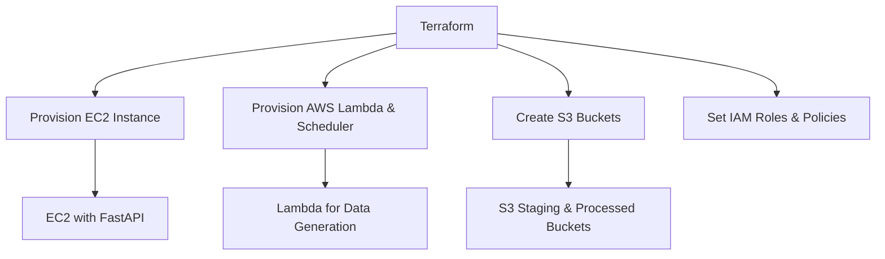
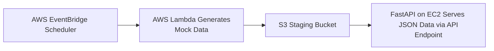
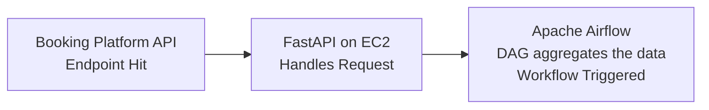
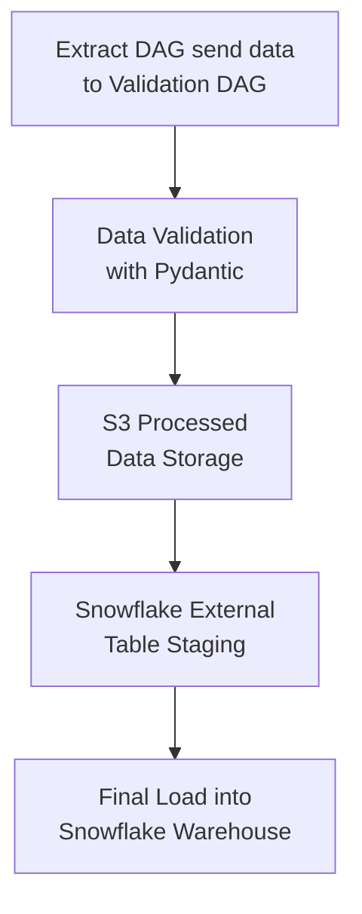

# Data Engineering Pipeline: Restaurant Reservation Data Management

This project demonstrates a full-scale data engineering pipeline built using industry-standard tools and practices.  
It collects daily reservation data for three restaurants from mock APIs simulating OpenTable and The Fork, processes and validates the data, and stores it in AWS S3. The data is then systematically loaded into a Snowflake data warehouse. The pipeline is fully automated using Apache Airflow and AWS services, with infrastructure provisioned using Terraform.

### Workflow
1. **Data Generation (AWS Lambda & Scheduler)**
   - **AWS Lambda** generates mock reservation data daily.
   - **AWS EventBridge Scheduler** automates the daily execution of Lambda.
   - Data is stored in an S3 raw bucket.

2. **API Simulation (FastAPI & EC2)**
   - An **EC2 instance** running FastAPI acts as a web server, simulating real-world API endpoints.
   - The API retrieves processed reservation data from S3 and serves it in JSON format.

3. **Data Processing & Validation (Python & Pydantic)**
   - Extracted data is validated using **Pydantic** models.
   - Unnecessary data is removed, and processed data is stored in a separate S3 staging bucket.

4. **Data Storage & Warehousing (AWS S3 & Snowflake)**
   - Processed data is loaded into **Snowflake** using the Snowflake Python connector.


### Infrastructure Provisioning
- Infrastructure, including EC2 instances, AWS Lambda functions, S3 buckets, IAM roles, and policies, are provisioned using **Terraform**.

### Pipeline Orchestration
- **Apache Airflow** orchestrates the entire ETL workflow, ensuring automated execution, monitoring, and error handling.
- Extended **logging** functionality enhances Airflow's default logs with custom messages for better traceability.


---

## 🔧 Tools & Technologies

## Technology Stack

- **AWS Lambda & EventBridge Scheduler**: Serverless compute & automation.
- **AWS EC2 & FastAPI**: Simulated real-world API endpoints.
- **Terraform**: Infrastructure as Code (IaC) for AWS resource provisioning.
- **Apache Airflow**: Pipeline orchestration and automation.
- **Snowflake**: Cloud data warehouse solution.
- **AWS S3**: Data Lake storage.
- **Python & SQL**: Core programming language.
- **Pydantic**: Data validation and modeling.
- **Boto3**: Python SDK for AWS.
- **Snowflake Python Connector**: Connecting Python applications to Snowflake.

---

## Flowchart

### Infrastructure Provisioning Flowchart



### Data Generation and Serving Flowchart



### Data Pipeline Flowchart




## 📦 Project Workflow

1. **Infrastructure Provisioning**  
   Provision 3 versioned S3 buckets (`raw`, `staging`, `processed`), EC2 instance, Eventbridge(for lambda) and IAM roles using **Terraform**.

2. **Daily Data Extraction**  
   Python scripts query booking data from:
   - OpenTable API
   - TheFork API

3. **Raw Data Storage**  
   Store unprocessed booking data in AWS S3 → `raw/` bucket.

4. **Data Cleaning & Transformation**  
   Process raw JSON/CSV files using Pandas and upload cleaned output to S3 → `staging/` bucket.

5. **Load to Snowflake**  
   Use **Snowflake Python Connector** or to load cleaned data from S3 into Snowflake tables.

6. **Orchestration**  
   Use **Apache Airflow** to schedule and automate the entire pipeline end-to-end.

7. **Analytics**  
   Build dashboards in Tableau connected directly to Snowflake.

---

## 📁 Project Structure

```bash
.
├── infra-terraform/            # All Terraform code for AWS infra
│   └── modules/
│       └── s3_bucket/
├── dags/                       # Airflow DAGs
├── scripts/                    # Python ETL scripts
├── notebooks/                  # EDA or dev notebooks
├── snowflake/                 # SQL scripts or Python Snowflake loaders
├── .gitignore
├── README.md
└── requirements.txt
```
---

## 👨‍💻 Author

[Paritosh Sharma Ghimire](https://www.linkedin.com/in/psgpyc/)
---

